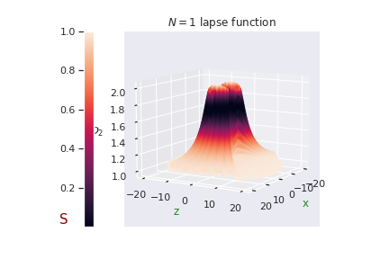

<!-- PROJECT SHIELDS -->
<!--
*** I'm using markdown "reference style" links for readability.
*** Reference links are enclosed in brackets [ ] instead of parentheses ( ).
*** See the bottom of this document for the declaration of the reference variables
*** for contributors-url, forks-url, etc. This is an optional, concise syntax you may use.
*** https://www.markdownguide.org/basic-syntax/#reference-style-links
-->
[![Contributors][contributors-shield]][contributors-url]
[![Forks][forks-shield]][forks-url]
[![Stargazers][stars-shield]][stars-url]
[![Issues][issues-shield]][issues-url]
[![GNU GPLv3 License][license-shield]][license-url]

<!-- PROJECT LOGO -->
 

  

  <h3 align="center">pyPetrov</h3>

  

    Local Petrov type classification for arbitrary spacetimes.
     
    <a href="https://github.com/Emmatassone/pyPetrov/issues">Report Bug</a> 
  

<!-- TABLE OF CONTENTS -->

  
Table of Contents

  <ol>
    <li>
      <a href="#about-the-project">About The Project</a>
      <ul>
        <li><a href="#built-with">Built With</a></li>
      </ul>
    </li>
    <li>
      <a href="#getting-started">Getting Started</a>
      <ul>
        <li><a href="#prerequisites">Prerequisites</a></li>
      </ul>
    </li>
    <li><a href="#usage">Usage</a></li>
    <li><a href="#roadmap">Roadmap</a></li>
    <li><a href="#contributing">Contributing</a></li>
    <li><a href="#license">License</a></li>
    <li><a href="#contact">Contact</a></li>
  </ol>

<!-- ABOUT THE PROJECT -->
## About The Project

pyPetrov is a project focused on the classification of arbitrary spacetimes, either analytical or numerical. Providing the psi scalars in a given point the code classify the approximate Petrov type, with a set of indexes. These indexes construct a notion of distance that let us know when a spacetime is near of being a certain type (type D for example). This notion is better suited for numerical spacetimes when we don't have any exact symmetry.

(<a href="#readme-top">back to top</a>)

### Built With

The project is built with python, with the help of the following libraries.

 [![NumPy][numpy-image]][numpy-url]

(<a href="#readme-top">back to top</a>)

<!-- GETTING STARTED -->
## Getting Started

To classificate a new spacetime, the psi scalars should be place in the .

### Prerequisites

This is an example of how to list things you need to use the software and how to install them.

<!-- USAGE EXAMPLES -->
## Usage

(<a href="#readme-top">back to top</a>)

<!-- ROADMAP -->
## Roadmap

- [ ] Add more spacetimes
  - [x] Kerr
  - [x] Bianchi Universe
  - [x] Regge-Wheeler
  - [ ] Teukolsky
- [ ] Add Numerical spacetime example

(<a href="#readme-top">back to top</a>)

<!-- CONTRIBUTING -->
## Contributing

If you have a suggestion that would make this better, please fork the repo and create a pull request. You can also simply open an issue with the tag "enhancement".
Don't forget to give the project a star! Thanks again!

1. Fork the Project
2. Create your Feature Branch (`git checkout -b feature/AmazingFeature`)
3. Commit your Changes (`git commit -m 'Add some AmazingFeature'`)
4. Push to the Branch (`git push origin feature/AmazingFeature`)
5. Open a Pull Request

(<a href="#readme-top">back to top</a>)

<!-- LICENSE -->
## License

Distributed under the MIT License. See `LICENSE` for more information.

(<a href="#readme-top">back to top</a>)

<!-- CONTACT -->
## Contact

Project Link: [https://github.com/Emmatassone/power-spectrum-classification](https://github.com/Emmatassone/pyPetrov)

(<a href="#readme-top">back to top</a>)

<!-- ACKNOWLEDGMENTS -->
## Acknowledgments

A special thanks should be done to the following 

(<a href="#readme-top">back to top</a>)

<!-- MARKDOWN LINKS & IMAGES -->
<!-- https://www.markdownguide.org/basic-syntax/#reference-style-links -->
[contributors-shield]: https://img.shields.io/github/contributors/Emmatassone/pyPetrov.svg?style=for-the-badge
[contributors-url]: https://github.com/Emmatassone/pyPetrov/graphs/contributors
[forks-shield]: https://img.shields.io/github/forks/Emmatassone/pyPetrov.svg?style=for-the-badge
[forks-url]: https://github.com/Emmatassone/pyPetrov/network/members
[stars-shield]: https://img.shields.io/github/stars/Emmatassone/pyPetrov.svg?style=for-the-badge
[stars-url]: https://github.com/Emmatassone/pyPetrov/stargazers
[issues-shield]: https://img.shields.io/github/issues/Emmatassone/pyPetrov.svg?style=for-the-badge
[issues-url]: https://github.com/Emmatassone/pyPetrov/issues
[license-shield]: https://img.shields.io/github/license/Emmatassone/pyPetrov.svg?style=for-the-badge
[license-url]: https://github.com/Emmatassone/pyPetrov/blob/master/LICENSE
[numpy-image]: https://encrypted-tbn0.gstatic.com/images?q=tbn:ANd9GcTPWiyqKtwOVyMgJl56JwotnQaIZ6ZNgB1NoJnMJn3X0DfC8vSBEra7Wzw0tpJHmVzyG2U&usqp=CAU
[numpy-url]: https://numpy.org/
